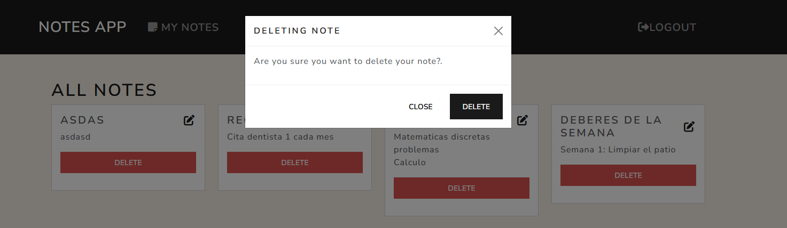

# Commands

### Production

```
npm i express connect-flash bcryptjs express-handlebars express-session method-override mongoose passport passport-local morgan
```

### Dev

```
npm i dotenv nodemon handlebars cors npm-check-updates
```

### create directories

```
mkdir src
cd src/
mkdir config controllers helpers models public routes views
```

### Preview

#### Home


#### Register and login


#### My notes section


#### Create note


#### Edit note


#### Delete note


